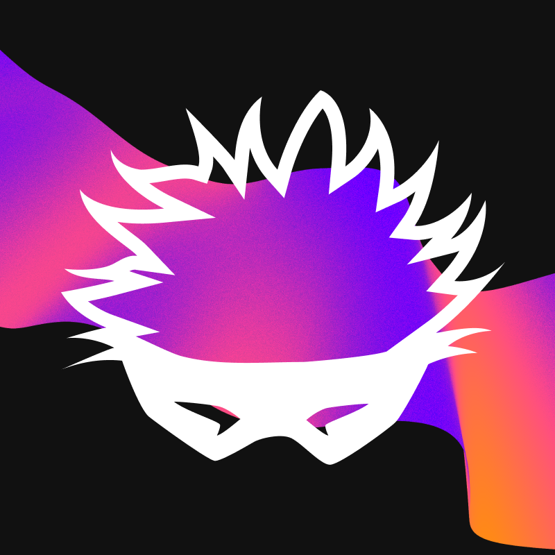

<!-- prettier-ignore-start -->
<!-- markdownlint-disable -->
<p align="center">
  
</p>

<h1 align="center">⚡ Satoru ⚡</h1>

<p align="center">
  <strong>Synthetics platform for Starknet, inspired by GMX v2 design.</strong>
</p>

<p align="center">
  <a href="LICENSE">
    
  </a>
  <a href="https://github.com/keep-starknet-strange/satoru/issues?q=is%3Aissue+is%3Aopen+label%3A%22help+wanted%22">
    
  </a>
  <a href="https://keep-starknet-strange.github.io/satoru/">
    
  </a>
</p>

<div align="center">

  [![Exploration_Team](https://img.shields.io/badge/Exploration_Team-29296E.svg?&style=for-the-badge&logo=data:image/svg%2bxml;base64,PD94bWwgdmVyc2lvbj0iMS4wIiBlbmNvZGluZz0iVVRGLTgiPz48c3ZnIGlkPSJhIiB4bWxucz0iaHR0cDovL3d3dy53My5vcmcvMjAwMC9zdmciIHZpZXdCb3g9IjAgMCAxODEgMTgxIj48ZGVmcz48c3R5bGU+LmJ7ZmlsbDojZmZmO308L3N0eWxlPjwvZGVmcz48cGF0aCBjbGFzcz0iYiIgZD0iTTE3Ni43Niw4OC4xOGwtMzYtMzcuNDNjLTEuMzMtMS40OC0zLjQxLTIuMDQtNS4zMS0xLjQybC0xMC42MiwyLjk4LTEyLjk1LDMuNjNoLjc4YzUuMTQtNC41Nyw5LjktOS41NSwxNC4yNS0xNC44OSwxLjY4LTEuNjgsMS44MS0yLjcyLDAtNC4yN0w5Mi40NSwuNzZxLTEuOTQtMS4wNC00LjAxLC4xM2MtMTIuMDQsMTIuNDMtMjMuODMsMjQuNzQtMzYsMzcuNjktMS4yLDEuNDUtMS41LDMuNDQtLjc4LDUuMThsNC4yNywxNi41OGMwLDIuNzIsMS40Miw1LjU3LDIuMDcsOC4yOS00LjczLTUuNjEtOS43NC0xMC45Ny0xNS4wMi0xNi4wNi0xLjY4LTEuODEtMi41OS0xLjgxLTQuNCwwTDQuMzksODguMDVjLTEuNjgsMi4zMy0xLjgxLDIuMzMsMCw0LjUzbDM1Ljg3LDM3LjNjMS4zNiwxLjUzLDMuNSwyLjEsNS40NCwxLjQybDExLjQtMy4xMSwxMi45NS0zLjYzdi45MWMtNS4yOSw0LjE3LTEwLjIyLDguNzYtMTQuNzYsMTMuNzNxLTMuNjMsMi45OC0uNzgsNS4zMWwzMy40MSwzNC44NGMyLjIsMi4yLDIuOTgsMi4yLDUuMTgsMGwzNS40OC0zNy4xN2MxLjU5LTEuMzgsMi4xNi0zLjYsMS40Mi01LjU3LTEuNjgtNi4wOS0zLjI0LTEyLjMtNC43OS0xOC4zOS0uNzQtMi4yNy0xLjIyLTQuNjItMS40Mi02Ljk5LDQuMyw1LjkzLDkuMDcsMTEuNTIsMTQuMjUsMTYuNzEsMS42OCwxLjY4LDIuNzIsMS42OCw0LjQsMGwzNC4zMi0zNS43NHExLjU1LTEuODEsMC00LjAxWm0tNzIuMjYsMTUuMTVjLTMuMTEtLjc4LTYuMDktMS41NS05LjE5LTIuNTktMS43OC0uMzQtMy42MSwuMy00Ljc5LDEuNjhsLTEyLjk1LDEzLjg2Yy0uNzYsLjg1LTEuNDUsMS43Ni0yLjA3LDIuNzJoLS42NWMxLjMtNS4zMSwyLjcyLTEwLjYyLDQuMDEtMTUuOGwxLjY4LTYuNzNjLjg0LTIuMTgsLjE1LTQuNjUtMS42OC02LjA5bC0xMi45NS0xNC4xMmMtLjY0LS40NS0xLjE0LTEuMDgtMS40Mi0xLjgxbDE5LjA0LDUuMTgsMi41OSwuNzhjMi4wNCwuNzYsNC4zMywuMTQsNS43LTEuNTVsMTIuOTUtMTQuMzhzLjc4LTEuMDQsMS42OC0xLjE3Yy0xLjgxLDYuNi0yLjk4LDE0LjEyLTUuNDQsMjAuNDYtMS4wOCwyLjk2LS4wOCw2LjI4LDIuNDYsOC4xNiw0LjI3LDQuMTQsOC4yOSw4LjU1LDEyLjk1LDEyLjk1LDAsMCwxLjMsLjkxLDEuNDIsMi4wN2wtMTMuMzQtMy42M1oiLz48L3N2Zz4=)](https://github.com/keep-starknet-strange)
</div>

<!-- markdownlint-restore -->
<!-- prettier-ignore-end -->

## ⚡ About Satoru ⚡

Satoru is a cutting-edge synthetics platform for Starknet, taking inspiration from the modular design of GMX v2.

Read the [Satoru Book](https://keep-starknet-strange.github.io/satoru/) to learn more about the project.

## 🛠️ Build

To build the project, run:

```bash
scarb build
```

## Satoru compatible frontends

You can find the list of Satoru-compatible frontends, all of which have been built on top of the Satoru platform : 

- [Zohal](https://github.com/Zohal-Starknet/zohal-interface)

## 🏛️ Infrastructure

<p align="center">
  
</p>

## 🧪 Test

To test the project, run:

```bash
snforge
```

## 🚀 Deploy

To deploy the contracts of Satoru, you first need to setup a smart wallet :

- Create a signer by following this tutorial : [Signers](https://book.starkli.rs/signers)

- Create an account by following this tutorial : [Accounts](https://book.starkli.rs/accounts/)

Once your smart wallet is setup, you can now run deployment files to deploy contracts, for example :

```bash
cd scripts

./deploy_contract.sh
```

## Deployed Contracts

- RoleStore: 0x07eacab18c343f30edfa9336b8eacce9bc56303d43c92609a88e8da25177f5b3
- DataStore: 0x0549539da18f4d574211365b6abd678ef940444b579900efedcb935210c41481
- OrderVault: 0x01f1252d6d02feb14cfa88beff415e1524d1cebb31870056567aae257104b6fd
- Router: 0x00dd0912017ee7c8151555394380acd1012a814916d384b12ca64afa0eae2bc5
- EventEmitter: 0x0284ae712869c0af4f538e9297e6965d3c9ba9110830944047de8d35da7ea447
- MarketToken: 0x044391e9498f440cc41ace136ea317f6bfa2080311085d1846529e421974a1d3
- MarketFactory: 0x05766918626a91ca83f52003eb03bbf1f13174aa22e340c8057d8d5d6affbfcf
- WithdrawalVault: 0x050c83c2bc74cc50676fdd5598b40f9d0d6d5ccf6ea3478a7999e29473da03f1
- SwapHandler: 0x039aa67b479f4870878ec6d3002f9fa9b8e98d4d3d10c1f32b5d394a456aab28
- ReferralStorage: 0x0189463034c24b2cb091dcb515287bea13a4767534f09e52692a4cdc30254001
- DepositVault: 0x07d435e7ab3a5cd4b872e5725b02898833cb9a7c62e2d9a6a9db324d61e2925e


## 📚 Resources

Here are some resources to help you get started:

- [Satoru Book](https://keep-starknet-strange.github.io/satoru/)
- [Cairo Book](https://book.cairo-lang.org/)
- [Starknet Book](https://book.starknet.io/)
- [Starknet Foundry Book](https://foundry-rs.github.io/starknet-foundry/)
- [Starknet By Example](https://starknet-by-example.voyager.online/)
- [Starkli Book](https://book.starkli.rs/)
- GMX v2 resources
  - [GMX Synthetics](https://github.com/gmx-io/gmx-synthetics)
  - [Trading on v2](https://docs.gmx.io/docs/trading/v2)
  - [Contracts for v2](https://docs.gmx.io/docs/api/contracts-v2/)
  - [Liquidity on v2](https://docs.gmx.io/docs/providing-liquidity/v2)

## 📖 License

This project is licensed under the **MIT license**. See [LICENSE](LICENSE) for more information.

## Contributors ✨

Thanks goes to these wonderful people ([emoji key](https://allcontributors.org/docs/en/emoji-key)):

<!-- ALL-CONTRIBUTORS-LIST:START - Do not remove or modify this section -->
<!-- prettier-ignore-start -->
<!-- markdownlint-disable -->
<table>
  <tbody>
    <tr>
      <td align="center" valign="top" width="14.28%"><a href="https://github.com/abdelhamidbakhta"><br /><sub><b>Abdel @ StarkWare </b></sub></a><br /><a href="https://github.com/keep-starknet-strange/satoru/commits?author=abdelhamidbakhta" title="Code">💻</a></td>
      <td align="center" valign="top" width="14.28%"><a href="https://github.com/sparqet"><br /><sub><b>sparqet</b></sub></a><br /><a href="https://github.com/keep-starknet-strange/satoru/commits?author=sparqet" title="Code">💻</a></td>
      <td align="center" valign="top" width="14.28%"><a href="https://github.com/zarboq"><br /><sub><b>zarboq</b></sub></a><br /><a href="https://github.com/keep-starknet-strange/satoru/commits?author=zarboq" title="Code">💻</a></td>
      <td align="center" valign="top" width="14.28%"><a href="https://github.com/drspacemn"><br /><sub><b>drspacemn</b></sub></a><br /><a href="https://github.com/keep-starknet-strange/satoru/commits?author=drspacemn" title="Code">💻</a></td>
      <td align="center" valign="top" width="14.28%"><a href="https://github.com/Sk8erboi84"><br /><sub><b>Michel</b></sub></a><br /><a href="https://github.com/keep-starknet-strange/satoru/commits?author=Sk8erboi84" title="Code">💻</a></td>
      <td align="center" valign="top" width="14.28%"><a href="https://github.com/delaaxe"><br /><sub><b>delaaxe</b></sub></a><br /><a href="https://github.com/keep-starknet-strange/satoru/commits?author=delaaxe" title="Code">💻</a></td>
      <td align="center" valign="top" width="14.28%"><a href="https://github.com/danilowhk"><br /><sub><b>danilowhk</b></sub></a><br /><a href="https://github.com/keep-starknet-strange/satoru/commits?author=danilowhk" title="Code">💻</a></td>
    </tr>
    <tr>
      <td align="center" valign="top" width="14.28%"><a href="https://github.com/ermvrs"><br /><sub><b>Erim</b></sub></a><br /><a href="https://github.com/keep-starknet-strange/satoru/commits?author=ermvrs" title="Code">💻</a></td>
      <td align="center" valign="top" width="14.28%"><a href="https://github.com/parketh"><br /><sub><b>parketh</b></sub></a><br /><a href="https://github.com/keep-starknet-strange/satoru/commits?author=parketh" title="Code">💻</a></td>
      <td align="center" valign="top" width="14.28%"><a href="https://github.com/enitrat"><br /><sub><b>Mathieu</b></sub></a><br /><a href="https://github.com/keep-starknet-strange/satoru/commits?author=enitrat" title="Code">💻</a></td>
      <td align="center" valign="top" width="14.28%"><a href="https://github.com/gaetbout"><br /><sub><b>gaetbout</b></sub></a><br /><a href="https://github.com/keep-starknet-strange/satoru/commits?author=gaetbout" title="Code">💻</a></td>
      <td align="center" valign="top" width="14.28%"><a href="https://github.com/ametel01"><br /><sub><b>Alex Metelli</b></sub></a><br /><a href="https://github.com/keep-starknet-strange/satoru/commits?author=ametel01" title="Code">💻</a></td>
      <td align="center" valign="top" width="14.28%"><a href="https://github.com/FabienCoutant"><br /><sub><b>Fabien C</b></sub></a><br /><a href="https://github.com/keep-starknet-strange/satoru/commits?author=FabienCoutant" title="Code">💻</a></td>
      <td align="center" valign="top" width="14.28%"><a href="https://github.com/rmzlb"><br /><sub><b>rmzlb</b></sub></a><br /><a href="https://github.com/keep-starknet-strange/satoru/commits?author=rmzlb" title="Code">💻</a></td>
    </tr>
    <tr>
      <td align="center" valign="top" width="14.28%"><a href="https://github.com/0xTitan"><br /><sub><b>0xTitan</b></sub></a><br /><a href="https://github.com/keep-starknet-strange/satoru/commits?author=0xTitan" title="Code">💻</a></td>
      <td align="center" valign="top" width="14.28%"><a href="https://github.com/Bal7hazar"><br /><sub><b>Bal7hazar @ Carbonable</b></sub></a><br /><a href="https://github.com/keep-starknet-strange/satoru/commits?author=Bal7hazar" title="Code">💻</a></td>
      <td align="center" valign="top" width="14.28%"><a href="https://github.com/zizou0x"><br /><sub><b>Zizou</b></sub></a><br /><a href="https://github.com/keep-starknet-strange/satoru/commits?author=zizou0x" title="Code">💻</a></td>
      <td align="center" valign="top" width="14.28%"><a href="https://github.com/Darlington02"><br /><sub><b>Darlington Nnam</b></sub></a><br /><a href="https://github.com/keep-starknet-strange/satoru/commits?author=Darlington02" title="Code">💻</a></td>
      <td align="center" valign="top" width="14.28%"><a href="https://github.com/eytanlvy"><br /><sub><b>Eytan Levy</b></sub></a><br /><a href="https://github.com/keep-starknet-strange/satoru/commits?author=eytanlvy" title="Code">💻</a></td>
      <td align="center" valign="top" width="14.28%"><a href="https://github.com/dbejarano820"><br /><sub><b>Daniel Bejarano</b></sub></a><br /><a href="https://github.com/keep-starknet-strange/satoru/commits?author=dbejarano820" title="Code">💻</a></td>
      <td align="center" valign="top" width="14.28%"><a href="https://github.com/JordyRo1"><br /><sub><b>Jordy Romuald</b></sub></a><br /><a href="https://github.com/keep-starknet-strange/satoru/commits?author=JordyRo1" title="Code">💻</a></td>
    </tr>
    <tr>
      <td align="center" valign="top" width="14.28%"><a href="https://github.com/StarkFishinator"><br /><sub><b>StarkFishinator</b></sub></a><br /><a href="https://github.com/keep-starknet-strange/satoru/commits?author=StarkFishinator" title="Code">💻</a></td>
      <td align="center" valign="top" width="14.28%"><a href="https://github.com/axelizsak"><br /><sub><b>Axel Izsak</b></sub></a><br /><a href="https://github.com/keep-starknet-strange/satoru/commits?author=axelizsak" title="Code">💻</a></td>
      <td align="center" valign="top" width="14.28%"><a href="https://github.com/lucienfer"><br /><sub><b>Luciefer</b></sub></a><br /><a href="https://github.com/keep-starknet-strange/satoru/commits?author=lucienfer" title="Code">💻</a></td>
      <td align="center" valign="top" width="14.28%"><a href="https://github.com/tevrat-aksoy"><br /><sub><b>tevrat aksoy</b></sub></a><br /><a href="https://github.com/keep-starknet-strange/satoru/commits?author=tevrat-aksoy" title="Code">💻</a></td>
      <td align="center" valign="top" width="14.28%"><a href="https://github.com/piotmag769"><br /><sub><b>Piotr Magiera</b></sub></a><br /><a href="https://github.com/keep-starknet-strange/satoru/commits?author=piotmag769" title="Code">💻</a></td>
      <td align="center" valign="top" width="14.28%"><a href="https://github.com/ftupas"><br /><sub><b>ftupas</b></sub></a><br /><a href="https://github.com/keep-starknet-strange/satoru/commits?author=ftupas" title="Code">💻</a></td>
      <td align="center" valign="top" width="14.28%"><a href="https://github.com/lambda-0x"><br /><sub><b>lambda-0x</b></sub></a><br /><a href="https://github.com/keep-starknet-strange/satoru/commits?author=lambda-0x" title="Code">💻</a></td>
    </tr>
    <tr>
      <td align="center" valign="top" width="14.28%"><a href="https://github.com/Tbelleng"><br /><sub><b>Tbelleng</b></sub></a><br /><a href="https://github.com/keep-starknet-strange/satoru/commits?author=Tbelleng" title="Code">💻</a></td>
      <td align="center" valign="top" width="14.28%"><a href="https://github.com/dic0de"><br /><sub><b>dic0de</b></sub></a><br /><a href="https://github.com/keep-starknet-strange/satoru/commits?author=dic0de" title="Code">💻</a></td>
      <td align="center" valign="top" width="14.28%"><a href="https://github.com/akhercha"><br /><sub><b>akhercha</b></sub></a><br /><a href="https://github.com/keep-starknet-strange/satoru/commits?author=akhercha" title="Code">💻</a></td>
      <td align="center" valign="top" width="14.28%"><a href="https://github.com/VictorONN"><br /><sub><b>VictorONN</b></sub></a><br /><a href="https://github.com/keep-starknet-strange/satoru/commits?author=VictorONN" title="Code">💻</a></td>
      <td align="center" valign="top" width="14.28%"><a href="https://github.com/kasteph"><br /><sub><b>kasteph</b></sub></a><br /><a href="https://github.com/keep-starknet-strange/satoru/commits?author=kasteph" title="Code">💻</a></td>
      <td align="center" valign="top" width="14.28%"><a href="https://github.com/khaeljy"><br /><sub><b>Khaeljy</b></sub></a><br /><a href="https://github.com/keep-starknet-strange/satoru/commits?author=khaeljy" title="Code">💻</a></td>
      <td align="center" valign="top" width="14.28%"><a href="https://github.com/JeanWoked"><br /><sub><b>JeanWoked</b></sub></a><br /><a href="https://github.com/keep-starknet-strange/satoru/commits?author=JeanWoked" title="Code">💻</a></td>
    </tr>
    <tr>
      <td align="center" valign="top" width="14.28%"><a href="https://github.com/vuittont60"><br /><sub><b>vuittont60</b></sub></a><br /><a href="https://github.com/keep-starknet-strange/satoru/commits?author=vuittont60" title="Code">💻</a></td>
      <td align="center" valign="top" width="14.28%"><a href="https://github.com/MavericksFive"><br /><sub><b>Arnaud Berger</b></sub></a><br /><a href="https://github.com/keep-starknet-strange/satoru/commits?author=MavericksFive" title="Code">💻</a></td>
      <td align="center" valign="top" width="14.28%"><a href="https://github.com/faytey"><br /><sub><b>faytey</b></sub></a><br /><a href="https://github.com/keep-starknet-strange/satoru/commits?author=faytey" title="Code">💻</a></td>
    </tr>
  </tbody>
</table>

<!-- markdownlint-restore -->
<!-- prettier-ignore-end -->

<!-- ALL-CONTRIBUTORS-LIST:END -->

This project follows the [all-contributors](https://github.com/all-contributors/all-contributors) specification. Contributions of any kind welcome!