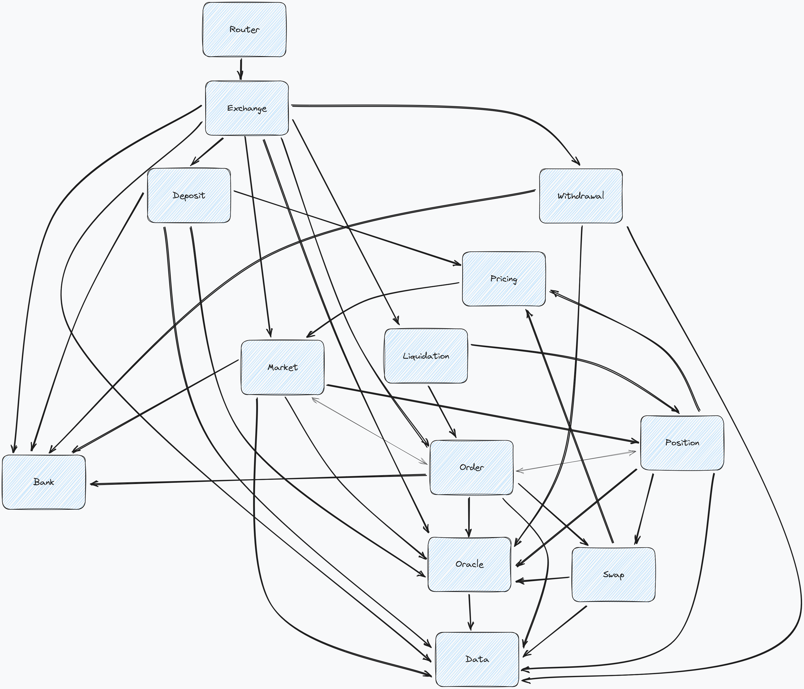
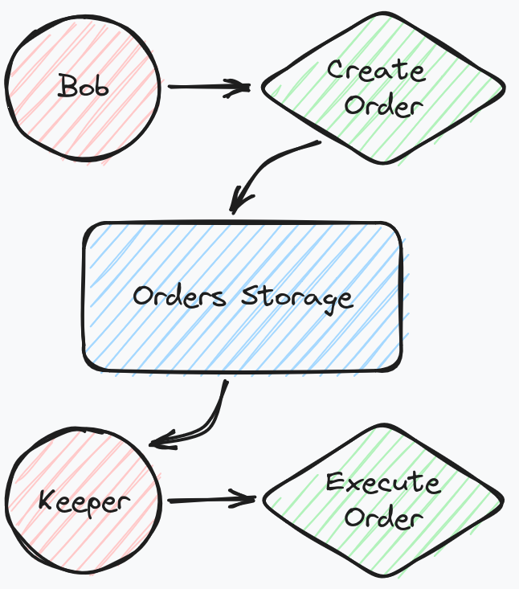

# Protocol Overview

Gojo high-level modules overview.

## Two steps actions in Gojo

Gojo employs a two-step approach for critical actions like Deposit, Withdrawal, and Order execution. This method ensures enhanced security and guards against front-running risks.

First user send its request and then it is verified and executed by a Keeper. This helps protect users from front-running issues.

**Process Overview:**

1. **User Initiation:** Users initiate actions by sending requests.

2. **Keeper Verification:** A designated Keeper validates requests and executes actions on users' behalf.

This approach safeguards against unauthorized actions and provides users with secure, reliable interactions within the system.